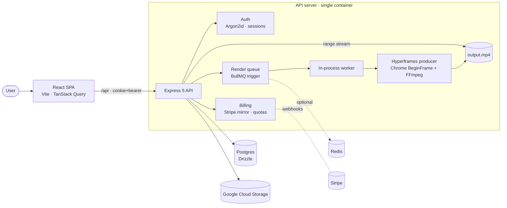

<div align="center">

# 🎬 Sorrel

**Turn a template, your brand kit, and a few sentences into branded short‑form video — ready to ship.**

Sorrel is a modular video‑production SaaS. Users compose branded short‑form video by picking HTML
templates; the backend renders them with a headless‑Chrome + FFmpeg pipeline and streams the
resulting MP4 back to the app.

[](https://github.com/aydogandagidir/sorrelvideo/actions/workflows/ci.yml)
[](./LICENSE)
[](#prerequisites)
[](https://www.typescriptlang.org/)
[](https://pnpm.io/)

</div>

---

> [!WARNING]
> **Status: private alpha.** Billing is live (Stripe). The Studio and AI modules are MVP;
> Bulk, Analytics, and Collaboration modules are partial or planned. The app is multi‑tenant —
> every persisted row is scoped by `userId`.

## Table of contents

- [Features](#-features)
- [Tech stack](#-tech-stack)
- [Architecture](#-architecture)
- [Monorepo layout](#-monorepo-layout)
- [Quick start](#-quick-start)
- [Configuration](#-configuration)
- [Scripts](#-scripts)
- [How rendering works](#-how-rendering-works)
- [Testing](#-testing)
- [Deployment](#-deployment)
- [Roadmap](#-roadmap)
- [Contributing](#-contributing)
- [Security](#-security)
- [License](#-license)

## ✨ Features

- **🎨 Studio** — fill in a headline, body, and call‑to‑action; Sorrel applies your **Brand Kit**
  (colors, font, logo, voice) and renders a 1080×1920 vertical MP4.
- **✨ AI copy** — describe your video and let the configured LLM (Anthropic or OpenAI) draft the
  headline/body/CTA. Brand voice is merged into the system prompt; prompt‑injection is softened by
  separating user input from instructions.
- **🧱 HTML templates** — each composition is a self‑contained HTML file rendered by Chrome's
  BeginFrame API, so designs are versionable and infinitely tweakable.
- **⚙️ Durable render queue** — renders run through a BullMQ + Redis queue with an in‑process worker
  that survives restarts; falls back to inline rendering when Redis is absent (zero‑dependency local
  dev). An atomic DB claim prevents double renders; startup recovery repairs orphaned jobs.
- **💳 Billing** — Stripe subscriptions mirrored locally via webhooks; Free vs Pro plans with
  monthly render/AI quotas enforced by row‑locked Postgres transactions.
- **🔐 Auth** — email/password (Argon2id) with cookie + bearer sessions, email verification,
  password reset, and optional GitHub/Google OAuth.
- **🏢 Multi‑tenant** — strict `userId` isolation on every row (401 / 403 / 404 contract).
- **📡 Type‑safe contracts** — one OpenAPI spec generates both the Zod schemas and the React Query
  hooks, so the frontend and backend never drift.

## 🧰 Tech stack

| Layer        | Technology                                                                              |
| ------------ | --------------------------------------------------------------------------------------- |
| **Runtime**  | Node.js 24 · TypeScript 5.9 (strict) · pnpm workspaces                                   |
| **Backend**  | Express 5 · Drizzle ORM + Postgres · BullMQ + Redis · Stripe · Pino · `@node-rs/argon2` |
| **Rendering**| `@hyperframes/producer` + `@hyperframes/core` (headless Chrome BeginFrame) · FFmpeg      |
| **Frontend** | React 19 · Vite 7 · Wouter · TanStack Query · Tailwind v4 · shadcn/ui · Framer Motion    |
| **Codegen**  | OpenAPI → Orval → Zod schemas + React Query hooks                                        |
| **Storage**  | Google Cloud Storage (signed URLs)                                                       |
| **Quality**  | Vitest (+ Testcontainers) · ESLint 9 (strict) · Prettier · Husky                        |
| **Hosting**  | Railway (single Docker container) · CI/CD via GitHub Actions                             |

## 🏗️ Architecture



The OpenAPI spec in `lib/api-spec` is the single source of truth for the HTTP contract: edit the
YAML, run codegen, and both the Zod validators (`lib/api-zod`) and the React Query hooks
(`lib/api-client-react`) are regenerated. In production a **single Docker container** runs the Node
API, which also serves the built SPA via `express.static` with an SPA fallback.

## 📦 Monorepo layout

| Package                    | Role                                                                |
| -------------------------- | ------------------------------------------------------------------ |
| `artifacts/api-server`     | Express API, routes, services, render pipeline, Stripe webhooks      |
| `artifacts/sorrel`         | The Sorrel React frontend                                           |
| `artifacts/mockup-sandbox` | Hyperframes composition development sandbox (dev‑only)              |
| `lib/db`                   | Drizzle schema (source of truth) + `db` / `pool` exports            |
| `lib/api-spec`             | OpenAPI YAML + Orval config (source of truth for API contracts)    |
| `lib/api-zod`              | **Generated** Zod schemas — do not edit by hand                    |
| `lib/api-client-react`     | **Generated** React Query hooks — do not edit by hand             |
| `lib/auth-web`             | Provider‑agnostic `useAuth` hook                                    |
| `lib/object-storage-web`   | Google Cloud Storage helper                                         |
| `lib/ai`                   | Provider‑agnostic LLM adapter (Anthropic / OpenAI)                 |
| `scripts`                  | Standalone helpers (e.g. `seed-products`)                           |

## 🚀 Quick start

### Prerequisites

- **Node.js 24** and **pnpm 10** (`corepack enable`)
- **Postgres** reachable via `DATABASE_URL` (local or Docker)
- **FFmpeg** on `PATH` and a Chromium the renderer can launch (Puppeteer downloads one on install)
- _Optional:_ **Redis** for the durable render queue (omit it and renders run inline)

### Setup

```bash
# 1. Install dependencies
pnpm install

# 2. Configure environment
cp .env.example .env        # then fill in DATABASE_URL, SESSION_SECRET, etc.

# 3. Apply the database schema (dev only)
pnpm --filter @workspace/db run push

# 4. Generate API types from the OpenAPI spec
pnpm --filter @workspace/api-spec run codegen

# 5. Run the API (serves on $PORT, default 8080) and the frontend (Vite)
pnpm --filter @workspace/api-server run dev
pnpm --filter @workspace/sorrel run dev
```

Then open the Vite URL the dev server prints. In production the API serves the SPA itself on a
single port — see [Deployment](#-deployment).

## ⚙️ Configuration

Copy [`.env.example`](./.env.example) to `.env` and fill it in. The essentials for local dev:

| Variable                  | Required        | Purpose                                                              |
| ------------------------- | --------------- | ------------------------------------------------------------------- |
| `DATABASE_URL`            | ✅              | Postgres connection string                                          |
| `SESSION_SECRET`          | ✅              | Session / token signing                                             |
| `PORT` · `BASE_PATH`      | ✅              | HTTP port · Vite base path (`/` locally)                            |
| `REDIS_URL`               | optional        | Enables the durable BullMQ render queue (unset → inline render)     |
| `STRIPE_SECRET_KEY` …     | billing         | Stripe API + webhook signing secret                                 |
| `AI_PROVIDER` + API key   | AI suggest      | `anthropic` (default) or `openai`                                   |
| `GCS_*`                   | uploads         | Google Cloud Storage auth + bucket paths                            |
| `RESEND_API_KEY`          | optional        | Auth emails (logged to stdout when unset)                           |

Every variable is documented in `.env.example` and in [`CLAUDE.md`](./CLAUDE.md). Unset optional
integrations degrade gracefully (no Redis → inline render, no Resend → emails to stdout, etc.).

## 📜 Scripts

Run from the repo root:

| Command                | What it does                                                       |
| ---------------------- | ----------------------------------------------------------------- |
| `pnpm run typecheck`   | Type‑check every package                                           |
| `pnpm run lint`        | ESLint (strict) · `pnpm run lint:fix` to auto‑fix                  |
| `pnpm test`            | Vitest (unit + Testcontainers integration) · `pnpm test:watch`    |
| `pnpm run build`       | Type‑check + build all shippable packages                         |

After editing the DB schema run `pnpm --filter @workspace/db run push`; after editing
`openapi.yaml` run `pnpm --filter @workspace/api-spec run codegen` (CI fails if generated files
drift).

## 🎬 How rendering works

1. The Studio form (or AI) produces `{ headline, bodyText, ctaText }` and creates a project.
2. `POST /api/projects/:id/render` **atomically claims** the project
   (`UPDATE … WHERE status <> 'rendering' RETURNING` — one winner, else `409`), checks the user's
   render quota, and enqueues the job (BullMQ when `REDIS_URL` is set, otherwise inline).
3. The worker reads the composition HTML, substitutes `{{brand.*}}` / `{{user.*}}` placeholders
   (HTML‑escaped) from the Brand Kit + project vars, and hands it to the Hyperframes producer.
4. Headless Chrome rasterizes each frame via the BeginFrame API; FFmpeg encodes them to
   `renders/<projectId>/output.mp4`.
5. The frontend polls every 3 s; once `ready`, the video streams from
   `GET /api/projects/:id/video` (HTTP range requests for seeking).
6. On boot, `recoverStuckRenders()` resets any project orphaned in `rendering` (e.g. a pod restart)
   so it never gets stuck.

## 🧪 Testing

Vitest runs four projects (`api-server`, `sorrel`, `auth-web`, `ai`):

- **Unit tests** (`*.test.ts[x]`) — DB‑less and fast.
- **Integration tests** (`*.integration.test.ts`, api‑server only) — run against a real Postgres
  booted by [Testcontainers](https://testcontainers.com/). They run **serially in a single fork**
  (they share one DB and truncate the same tables, so parallel runs would deadlock). When Docker is
  not available they skip themselves; CI always runs them.

```bash
pnpm test            # CI mode
pnpm test:watch      # dev
pnpm test:coverage   # with V8 coverage
```

Husky runs `lint-staged` on commit and `typecheck + lint + test` on push.

## 🚢 Deployment

Hosted on **Railway** as a single Docker container that runs the Node API and serves the built SPA.
CI must be green on `main`, then the deploy workflow ships the image. Full one‑time setup (Stripe,
Resend, GCS, OAuth, DNS, first schema push) is documented in **[DEPLOYMENT.md](./DEPLOYMENT.md)**.

## 🗺️ Roadmap

- Multi‑instance auth rate‑limiting backed by Redis (`rate-limit-redis`)
- Static legal pages (Terms / Privacy) + cookie banner
- End‑to‑end Playwright smoke test (signup → Studio → render → MP4)
- Module completion: Bulk · Analytics · Collaboration
- AI v2 (streaming, per‑field regen, prompt history) and Studio v2 (timeline editor, custom assets)

## 🤝 Contributing

This is a private, proprietary codebase. Internal contributors: please read
**[CONTRIBUTING.md](./CONTRIBUTING.md)** for the development workflow, branch/commit conventions, and
the quality gates that must pass before merge. The deep architectural reference lives in
**[CLAUDE.md](./CLAUDE.md)**.

## 🔐 Security

Found a vulnerability? Please follow **[SECURITY.md](./SECURITY.md)** — do **not** open a public
issue for security reports.

## 📄 License

**Proprietary — all rights reserved.** This source is published for transparency and authorized
collaborators only; it is **not** open source. See **[LICENSE](./LICENSE)**. No permission is granted
to use, copy, modify, or distribute this software without a separate written agreement.

<div align="center">
<sub>© 2026 Sorrel. Built with TypeScript, React, and a lot of headless Chrome.</sub>
</div>
